# 📊 FLOWCHARTS - Arduino OS PKM Project
## Kumpulan Diagram Alur Sistem Lengkap (Mermaid Format)

---

## 📑 Daftar Isi
1. [Arsitektur Sistem Keseluruhan](#1-arsitektur-sistem-keseluruhan)
2. [Data Flow Architecture](#2-data-flow-architecture)
3. [Code Development Flow](#3-code-development-flow)
4. [Remote Access Flow](#4-remote-access-flow)
5. [AI Assistance Flow](#5-ai-assistance-flow)
6. [Dashboard Builder Flow](#6-dashboard-builder-flow)
7. [Developer vs End-User Mode Flow](#7-developer-vs-end-user-mode-flow)
8. [Cloudflare Tunnel Architecture](#8-cloudflare-tunnel-architecture)
9. [Sprint Development Flow](#9-sprint-development-flow)
10. [Kompilasi dan Upload Flow](#10-kompilasi-dan-upload-flow)
11. [WebSocket Communication Flow](#11-websocket-communication-flow)
12. [Backend API Architecture](#12-backend-api-architecture)
13. [Usability Testing Flow](#13-usability-testing-flow)
14. [Project Lifecycle](#14-project-lifecycle)
15. [OTA Update Flow](#15-ota-update-flow)
16. [Serial Communication Flow](#16-serial-communication-flow)

---

## 1. Arsitektur Sistem Keseluruhan

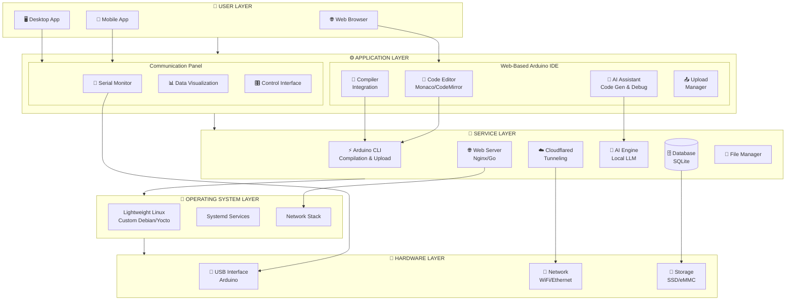

---

## 2. Data Flow Architecture

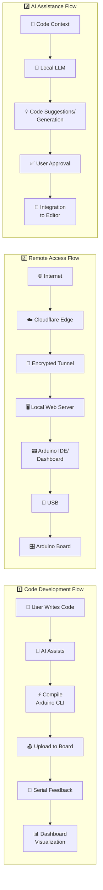

---

## 3. Code Development Flow

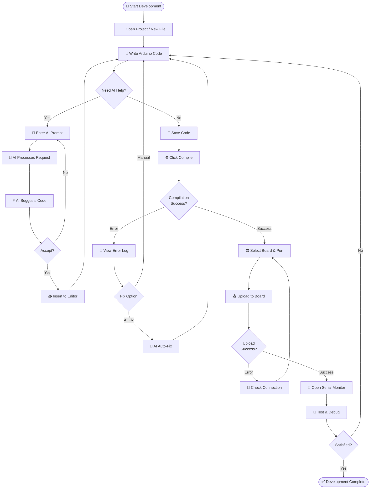

---

## 4. Remote Access Flow (Cloudflare Tunnel)

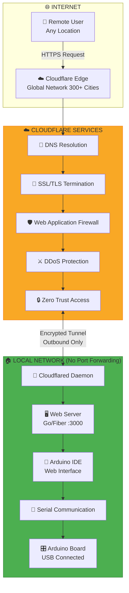

---

## 5. AI Assistance Flow

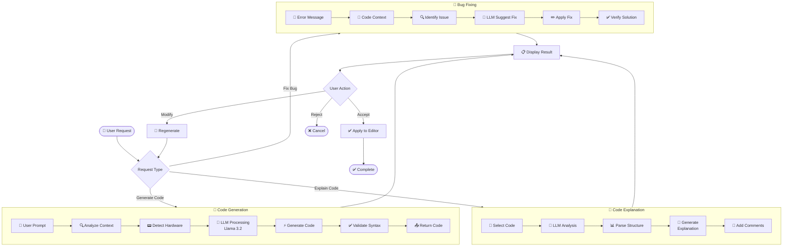

---

## 6. Dashboard Builder Flow

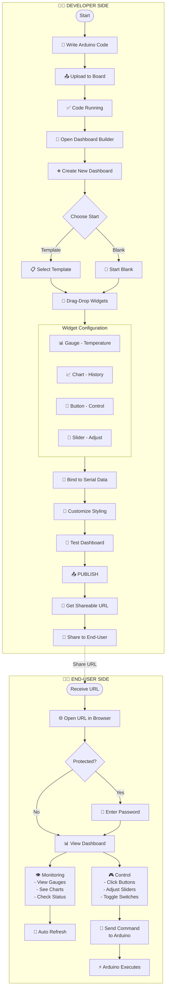

---

## 7. Developer vs End-User Mode Flow

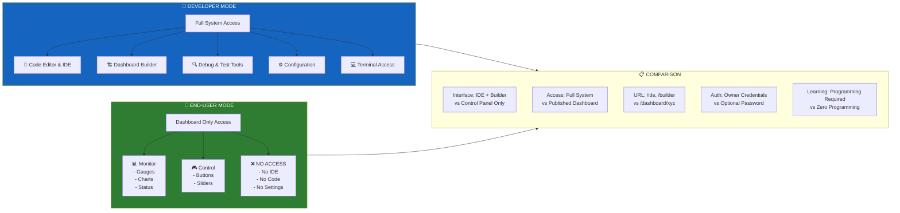

---

## 8. Cloudflare Tunnel Setup Flow

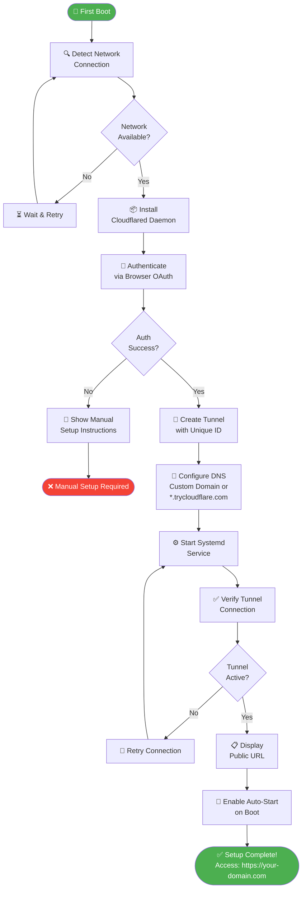

---

## 9. Sprint Development Flow (Agile)

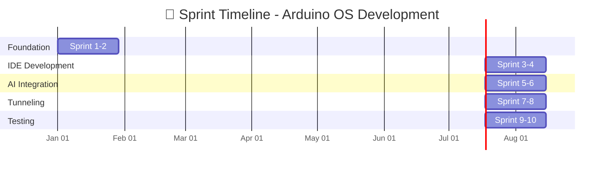

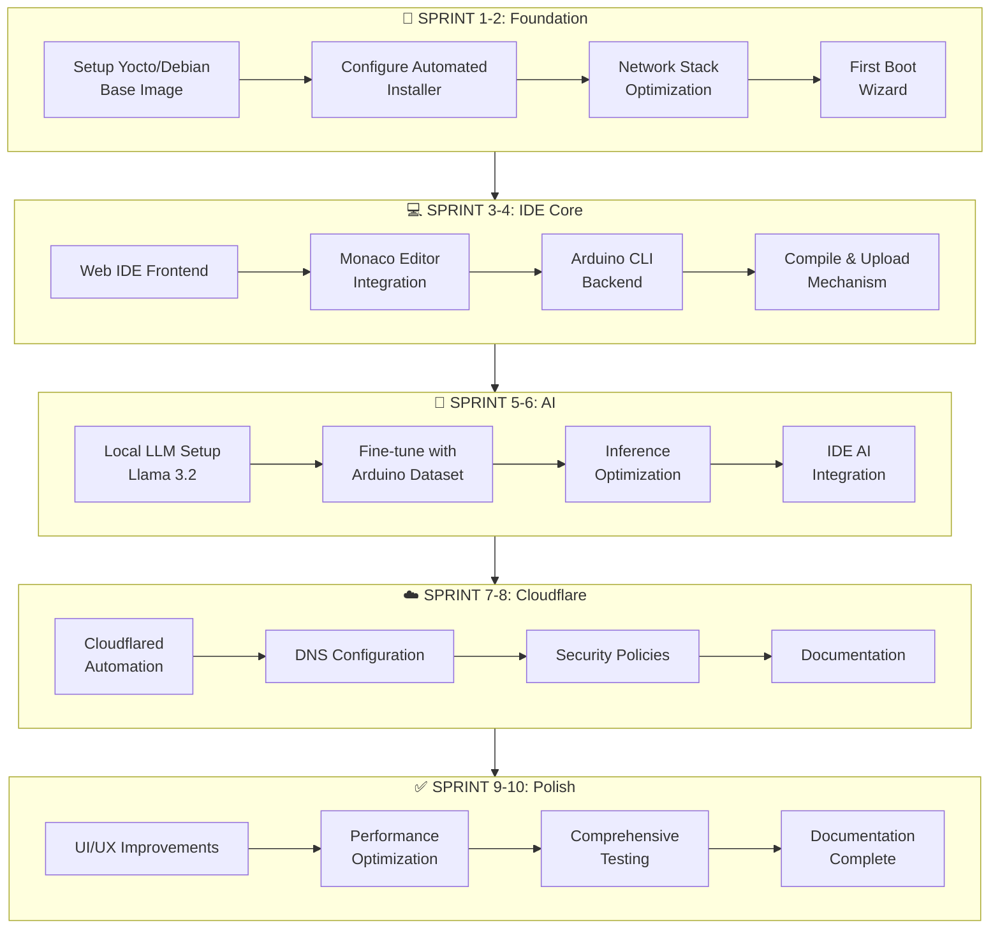

---

## 10. Kompilasi dan Upload Flow

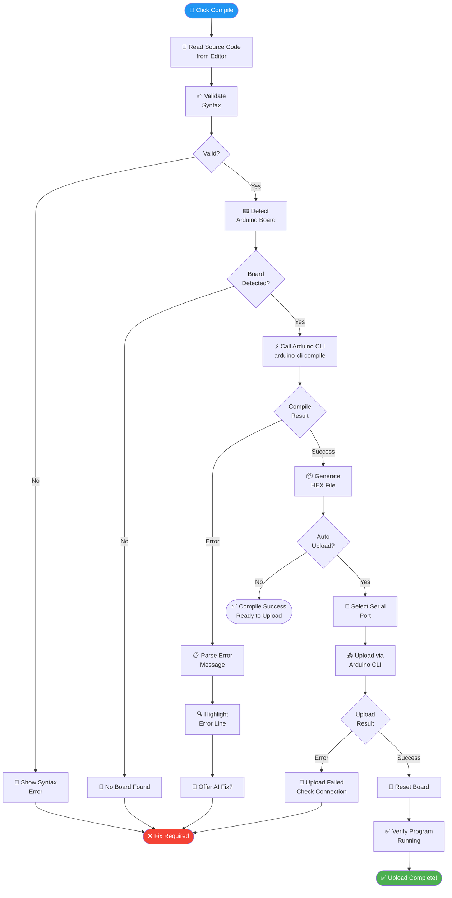

---

## 11. WebSocket Communication Flow

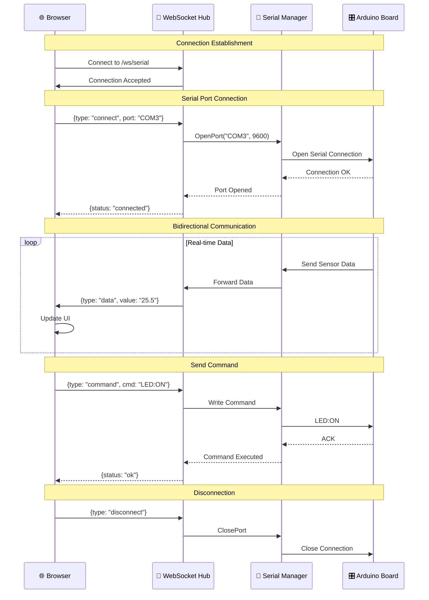

---

## 12. Backend API Architecture

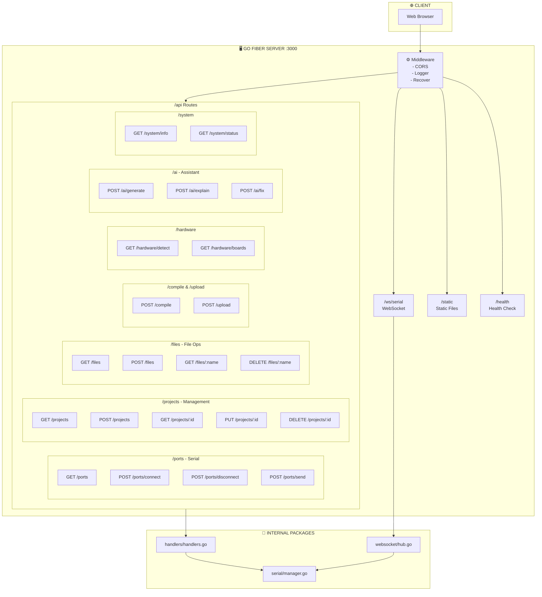

---

## 13. Usability Testing Flow

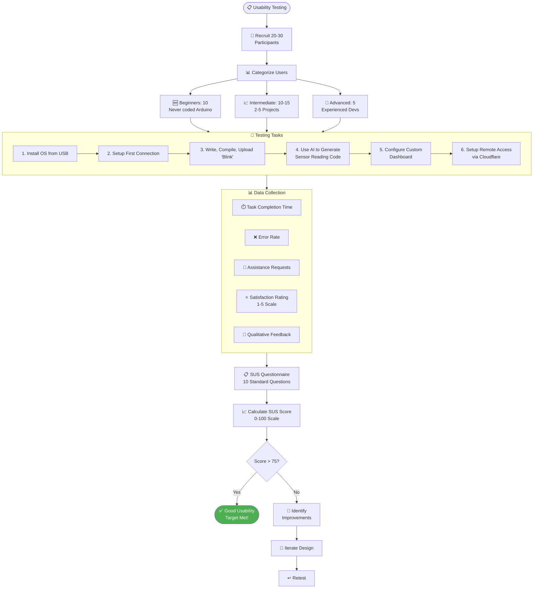

---

## 14. Project Lifecycle (Design Science Research)

```mermaid
flowchart LR
    subgraph PHASE1["1️⃣ Problem Identification"]
        P1A[❌ Complex Setup<br/>Environment]
        P1B[❌ Difficult Remote<br/>Access]
        P1C[❌ Resource<br/>Limitations]
        P1D[❌ Lack of<br/>Integration]
    end
    
    subgraph PHASE2["2️⃣ Solution Objectives"]
        P2A[✅ All-in-One OS<br/>Ready-to-Use]
        P2B[✅ Setup < 15 min<br/>Automated]
        P2C[✅ Resource-Efficient<br/>1GB RAM, 4GB Storage]
        P2D[✅ Free & Open<br/>No Paid Services]
        P2E[✅ Enterprise Security<br/>Cloudflare Tunnel]
    end
    
    subgraph PHASE3["3️⃣ Design & Development"]
        P3A[🔧 Sprint 1-2:<br/>Core OS]
        P3B[💻 Sprint 3-4:<br/>Web IDE]
        P3C[🤖 Sprint 5-6:<br/>AI Integration]
        P3D[☁️ Sprint 7-8:<br/>Tunnel Setup]
        P3E[✅ Sprint 9-10:<br/>Testing]
    end
    
    subgraph PHASE4["4️⃣ Demonstration"]
        P4A[🎯 Proof of Concept]
        P4B[📋 Use Case<br/>Scenarios]
        P4C[📊 Performance<br/>Benchmarks]
    end
    
    subgraph PHASE5["5️⃣ Evaluation"]
        P5A[📋 SUS Testing]
        P5B[⏱️ Performance<br/>Metrics]
        P5C[📊 Comparative<br/>Study]
        P5D[⭐ User Survey]
    end
    
    subgraph PHASE6["6️⃣ Communication"]
        P6A[📖 Technical Docs]
        P6B[📚 User Manual]
        P6C[🌐 Open Source<br/>Repository]
        P6D[📄 Academic<br/>Publication]
    end
    
    PHASE1 --> PHASE2 --> PHASE3 --> PHASE4 --> PHASE5 --> PHASE6
```

---

## 15. OTA Update Flow

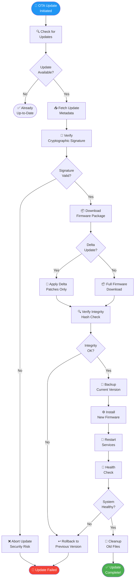

---

## 16. Serial Communication Flow

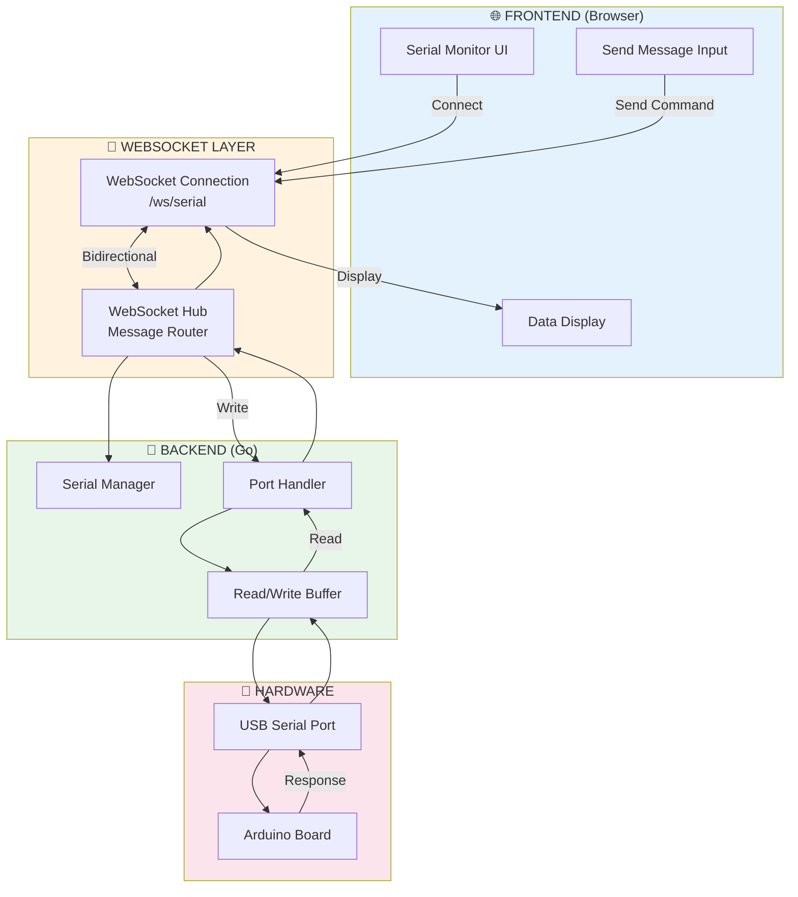

---

## 📊 Comparison Flowchart: Our System vs Traditional

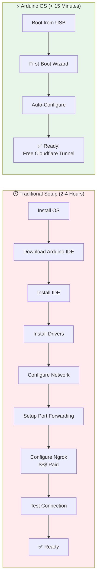

---

## 🎯 Smart Agriculture Use Case Flow

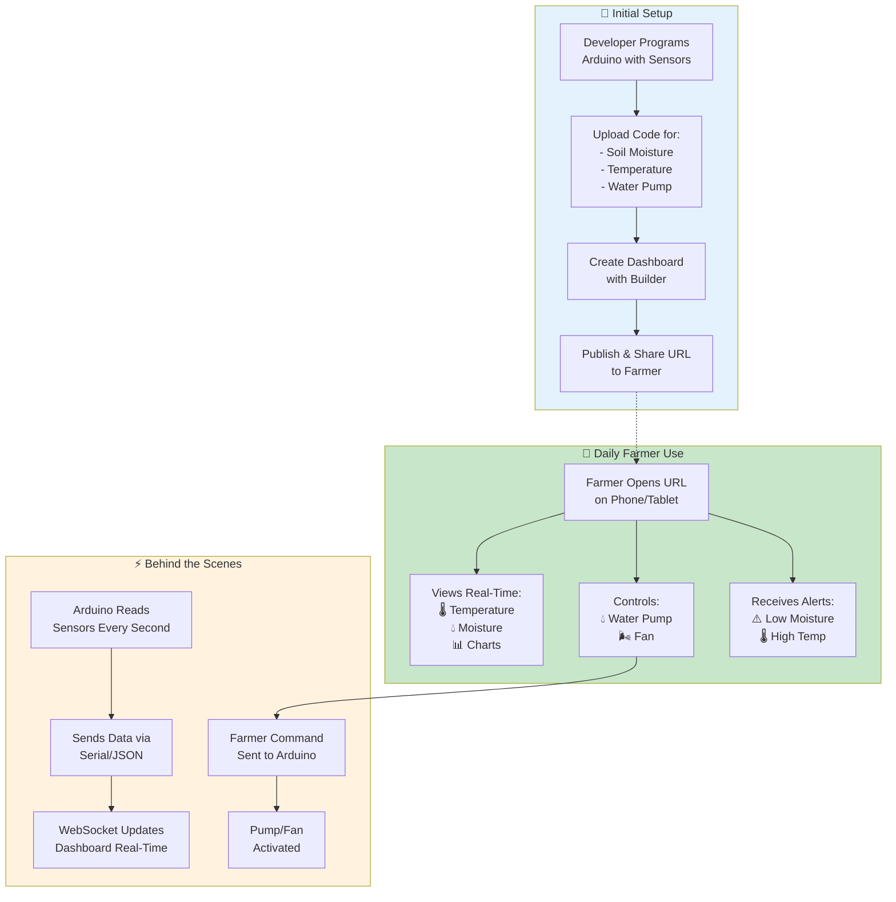

---

## 📈 Performance Metrics Comparison

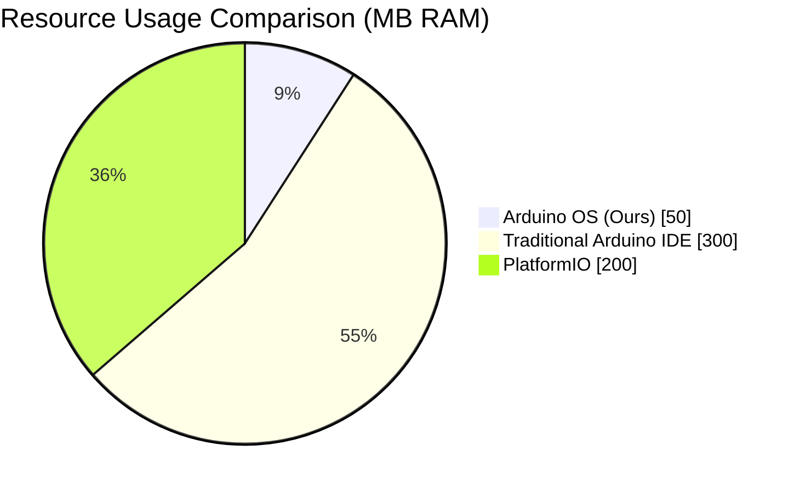

```mermaid
xychart-beta
    title "Setup Time Comparison (Minutes)"
    x-axis ["Traditional", "PlatformIO", "Arduino OS (Ours)"]
    y-axis "Minutes" 0 --> 250
    bar [180, 120, 15]
```

---

## ✅ Milestone Checklist Flowchart

```mermaid
flowchart LR
    M1([🏁 M1<br/>Month 2<br/>Infrastructure]) --> M2([🏗️ M2<br/>Month 4<br/>Core System])
    M2 --> M3([🔧 M3<br/>Month 6<br/>Integration])
    M3 --> M4([🧪 M4<br/>Month 8<br/>Beta Release])
    M4 --> M5([✅ M5<br/>Month 10<br/>Final])
    
    M1 --- C1["✓ Dev Environment<br/>✓ Dataset Ready<br/>✓ Base OS Bootable"]
    M2 --- C2["✓ IDE Compiles<br/>✓ Upload Works<br/>✓ Basic Features"]
    M3 --- C3["✓ AI Integrated<br/>✓ Tunnel Working<br/>✓ Alpha Version"]
    M4 --- C4["✓ Testing Done<br/>✓ Bugs Fixed<br/>✓ Optimized"]
    M5 --- C5["✓ Report Complete<br/>✓ Documentation<br/>✓ Ready Deploy"]
    
    style M1 fill:#4caf50,color:#fff
    style M2 fill:#4caf50,color:#fff
    style M3 fill:#4caf50,color:#fff
    style M4 fill:#ff9800,color:#fff
    style M5 fill:#2196f3,color:#fff
```

---

*📅 Generated: January 2026*
*📁 Project: PKM - Arduino OS for IoT Smart System Development*
*🔧 Format: Mermaid Diagrams*
